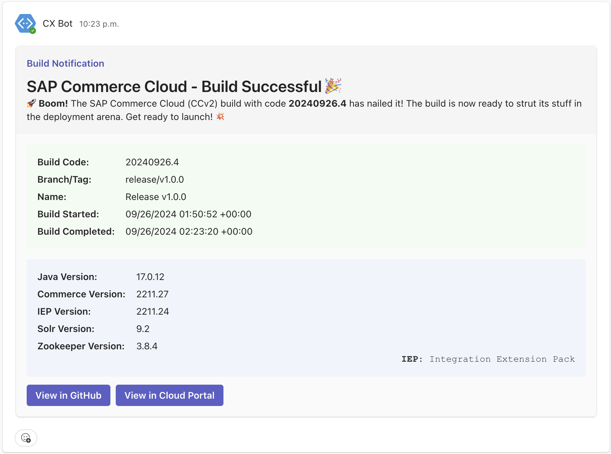

import { Icon } from '@astrojs/starlight/components';
import { Aside } from '@astrojs/starlight/components';

These GitHub Actions includes the following functionalities to send notifications when a build or deployment is triggered or completed in SAP Commerce Cloud in the Public Cloud (CCv2) projects.

## Webhooks

### Microsoft Teams <Icon name="microsoftTeams" label="Microsoft Teams"  color="#6264A7"/>

To send notifications to Microsoft Teams, you need to configure the webhook URL in the GitHub repository secrets. Define the environment variable in the workflow file to use the webhook URL.

```yaml {2}
env:
  WEBHOOK_URL: ${{ secrets.MS_TEAMS_WEBHOOK_URL }}
```
And also while using build or deploy action, you can pass the _notify_ input parameter as _true_ to send notifications to Microsoft Teams.

```yaml {7}
- name: Test Action
  id: build-action
  uses: sap-cx-actions/commerce-build@v1
  with:
    branch: release/v1.0.0
    buildName: Release v1.0.0
    notify: true
```

#### Sample Notifications

##### Build Action

###### Build Triggered


###### Build Successful


###### Build Failed


##### Deploy Action

###### Deployment Started


###### Deployment Successful


###### Deployment Failed


### Slack <Icon name="slack" label="Slack" color="#E01E5A"/>

To send notifications to Slack, you need to configure the webhook URL in the GitHub repository secrets. You need to pass the webhook URL as an environment variable in the workflow file.

```yaml {2}
env:
  WEBHOOK_URL: ${{ secrets.SLACK_WEBHOOK_URL }}
```

Also, while using build or deploy action, you can pass the _notify_ input parameter as _true_ to send notifications to Slack.

```yaml {7}
- name: Test Action
  id: deploy-action
  uses: sap-cx-actions/commerce-deploy@v1
  with:
    buildCode: '20240910.1'
    environmentCode: 'd1'
    notify: true
```

#### Sample Notifications

##### Build Action

###### Build Triggered


###### Build Successful


###### Build Failed


##### Deploy Action

###### Deployment Started


###### Deployment Successful


###### Deployment Failed


## Email

<Aside type="caution">
    Email notifications are not available yet. We are working on adding this feature soon.
</Aside>